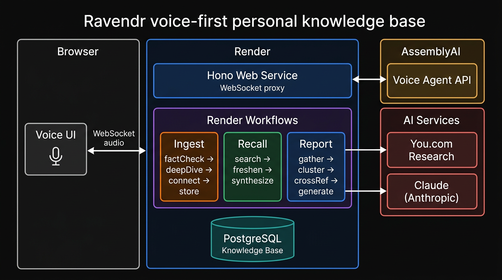
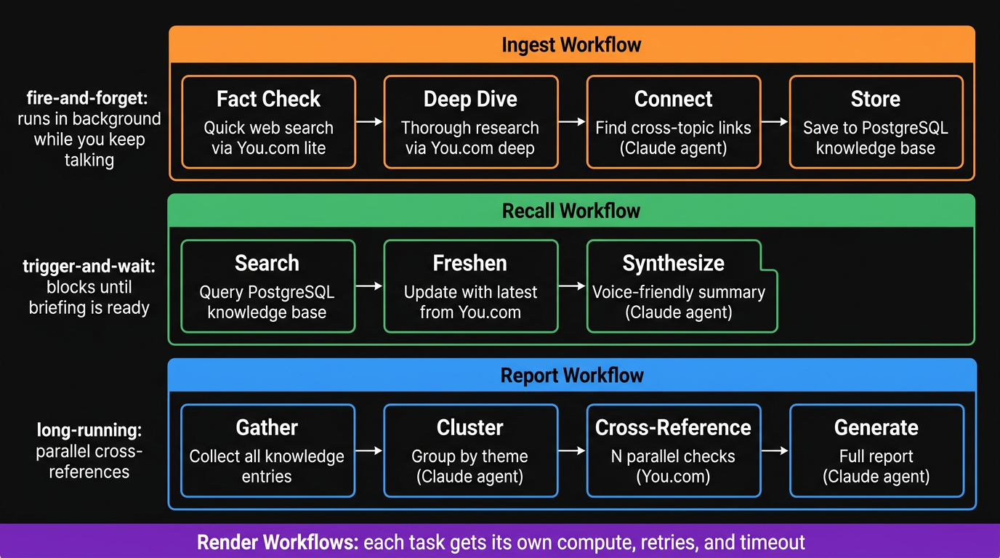

# Ravendr

[](https://render.com/deploy?repo=https://github.com/ojusave/ravendr)

A voice-first personal knowledge base. Talk to it, and it researches, fact-checks, stores, and recalls what you've discussed: across conversations.

## How it works



The web service proxies WebSocket audio between the browser and [AssemblyAI](https://www.assemblyai.com)'s voice agent. When the agent calls a tool, the server routes it to a [Render Workflow](https://render.com/workflows) that runs in the background.



Two calling patterns: `startTask` alone for fire-and-forget (ingest runs while you keep talking), `startTask` + `.get()` when the voice agent needs a result before it can speak (recall).

## Prerequisites

- [AssemblyAI](https://www.assemblyai.com/app), [Render](https://render.com/docs/api#1-create-an-api-key), [Anthropic](https://console.anthropic.com/), and [You.com](https://you.com) API keys
- A [Render account](https://render.com/register?utm_source=github&utm_medium=referral&utm_campaign=ojus_demos&utm_content=readme_link)

## Deploy

### 1. Web service + database (via Blueprint)

Click **Deploy to Render** above. The [`render.yaml`](render.yaml) creates the web service and a PostgreSQL database. Set `ASSEMBLYAI_API_KEY` and `RENDER_API_KEY` during setup.

### 2. Workflow service (manual)

1. [Render Dashboard](https://dashboard.render.com) > **New** > **Workflow**
2. Connect the same repo
3. Build: `npm install && npm run build`
4. Start: `node dist/workflows/index.js`
5. Name: `ravendr-workflows` (must match `WORKFLOW_SLUG`)
6. Env vars: `ANTHROPIC_API_KEY`, `YOU_API_KEY`, `DATABASE_URL` ([Internal URL](https://render.com/docs/databases#connecting-from-within-render)), `NODE_VERSION`: `22`

## Configuration

| Variable | Where | Default | Description |
|---|---|---|---|
| `ASSEMBLYAI_API_KEY` | Web service | (required) | Voice agent |
| `RENDER_API_KEY` | Web service | (required) | Workflow triggers |
| `DATABASE_URL` | Both | (required) | PostgreSQL connection string |
| `WORKFLOW_SLUG` | Web service | `ravendr-workflows` | Must match workflow service name |
| `ANTHROPIC_API_KEY` | Workflow | (required) | Claude for AI agents |
| `YOU_API_KEY` | Workflow | (required) | Web research |
| `ANTHROPIC_MODEL` | Workflow | `claude-sonnet-4-20250514` | Claude model ID |

## Project structure

```
src/
  server.ts              Hono web server (HTTP + WebSocket)
  voice/
    config.ts            AssemblyAI session config and tool definitions
    proxy.ts             WebSocket proxy: browser <> AssemblyAI <> Workflows
  agents/
    index.ts             Supervisor agent + sub-agent composition
    fact-checker.ts      Scores claim confidence against evidence
    synthesizer.ts       Voice-friendly summaries
    connector.ts         Cross-topic relationship detection
  tools/
    learn.ts             learn_topic > Ingest workflow
    recall.ts            recall_topic > Recall workflow
    report.ts            generate_report > Report workflow
  workflows/
    index.ts             Workflow entry point
    ingest.ts            factCheck + deepDive > connect > store
    recall.ts            search > freshen > synthesize
    report.ts            gather > cluster > crossRef (parallel) > generate
  lib/
    db.ts                PostgreSQL schema + queries
    you-client.ts        You.com Research API wrapper
  static/index.html      Voice UI and workflow activity panel
render.yaml              Render Blueprint
```

## API

**`WebSocket /ws/voice`**: proxies audio between browser and AssemblyAI. Intercepts tool calls and routes to Render Workflows.

**`GET /api/workflows/recent`**: 10 most recent workflow runs.

**`GET /api/knowledge`**: all knowledge entries.

**`GET /api/report/:taskRunId`**: result of a completed report task.

**`GET /health`**: `{ "status": "ok" }`.

## Troubleshooting

**Voice connection fails**: check `ASSEMBLYAI_API_KEY` is set on the web service.

**Workflows never complete**: verify the workflow service name matches `WORKFLOW_SLUG` (default: `ravendr-workflows`).

**"recall" returns empty**: ingest runs in the background. If you recall a topic right after mentioning it, the research may still be running.

**Database errors**: web service gets `DATABASE_URL` from Blueprint. Workflow service needs it copied manually from the database settings (Internal URL).
